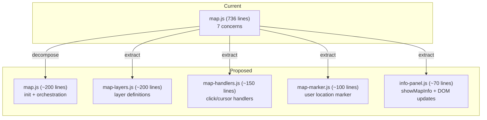
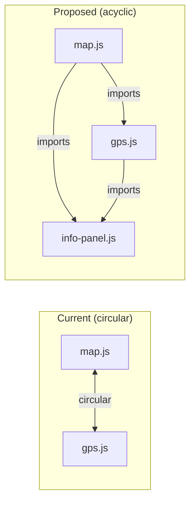

# Architecture Proposal: Incremental Module Decomposition

**Status:** Proposal (not yet implemented)
**Author:** Agent [ARCH]
**Risk Level:** Medium — requires careful incremental migration with test validation at each step

---

## Problem Statement

`map.js` (736 lines) contains 7 distinct concerns and has a circular dependency with `gps.js`. The shared mutable `state` object has no change notification mechanism. These issues will compound as features are added.

---

## Proposed Module Structure



### Module Responsibilities

| Module | Responsibility | Exports |
|--------|---------------|---------|
| `map.js` | Map creation, source setup, orchestration | `initMap`, `scheduleMapInit` |
| `map-layers.js` | Layer style definitions as data | `basemapLayers`, `overlayLayers`, `dataLayers` |
| `map-handlers.js` | Click handlers, cursor management | `attachClickHandlers`, `attachCursorHandlers` |
| `map-marker.js` | User location marker + accuracy circle | `updateUserLocationMarker`, `createCircleGeoJSON` |
| `info-panel.js` | Info panel DOM updates | `showMapInfo` |

### Circular Dependency Resolution



By extracting `showMapInfo` into `info-panel.js`, the circular dependency is broken. Both `map.js` and `gps.js` import from `info-panel.js` but never from each other.

---

## State Management Enhancement

### Current Pattern
```js
// Any module can mutate at any time
export const state = { waterSources: [], currentMile: 0, ... };
state.currentMile = 42; // No notification
```

### Proposed Pattern (Minimal Event Bus)
```js
// state.js (renamed from utils.js state portion)
const listeners = new Map();

export const state = {
  _data: { waterSources: [], currentMile: 0, ... },

  get(key) { return this._data[key]; },

  set(key, value) {
    this._data[key] = value;
    const fns = listeners.get(key) || [];
    fns.forEach(fn => fn(value));
  },

  on(key, fn) {
    if (!listeners.has(key)) listeners.set(key, []);
    listeners.get(key).push(fn);
  }
};
```

**This is intentionally minimal.** No framework, no proxies, no immutability. Just get/set with optional change listeners. This enables:
- Elevation chart re-rendering when `currentMile` changes (instead of explicit calls)
- Future offline state persistence (subscribe to changes, write to localStorage)

**Migration path:** This can be done incrementally by keeping the old `state.xxx` access working during transition.

---

## Implementation Plan

Each step should be a separate commit. Run `npm run test:all` after each step.

### Step 1: Extract `info-panel.js` from `map.js`
- Move `showMapInfo` function and its DOM interaction code
- Update imports in `map.js`, `gps.js`, `app.js`
- **Breaks circular dependency**
- Risk: Low

### Step 2: Extract `map-layers.js`
- Move all `addLayer` call configurations into exported arrays/objects
- `map.js` iterates and calls `map.addLayer` for each
- Risk: Low (pure data extraction)

### Step 3: Extract `map-marker.js`
- Move `updateUserLocationMarker` and `createCircleGeoJSON`
- Risk: Low (self-contained concern)

### Step 4: Extract `map-handlers.js`
- Move click handlers and cursor management
- Receives `map` instance as parameter
- Risk: Medium (handlers reference `pendingMileUpdate` counter)

### Step 5: (Optional) Add state change notifications
- Wrap `state` with get/set
- Add listeners for `currentMile` changes
- Risk: Medium (touches many modules)

---

## What This Proposal Does NOT Change

- No build step is added (stays vanilla ES modules)
- No framework is introduced
- No TypeScript is added
- No user-facing behavior changes
- Tests are not modified (only import paths if modules move)
- The overall file organization (`public/js/`) stays the same

---

## Decision Criteria

Implement this proposal if:
- New map features are planned (route progress, weather overlay, campsite markers)
- The circular dependency causes an actual bug
- A second developer needs to work on map code

Defer this proposal if:
- The app is feature-stable and only needs bug fixes
- No new map-related features are planned
