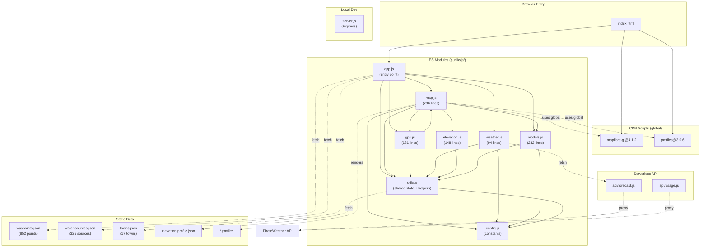
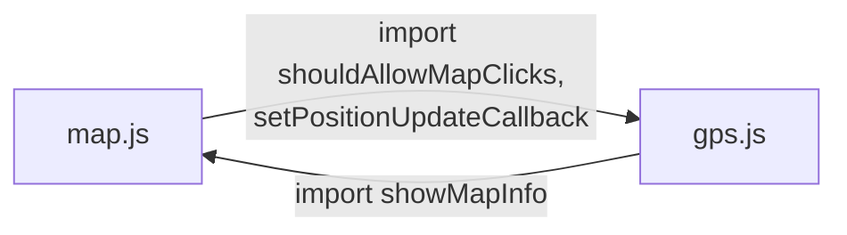

# Architectural Review — [ARCH]

## 1. Current Module Dependency Map



### Circular Dependency: `gps.js` <-> `map.js`



This is a **real circular import**. ES modules handle it via live bindings, and it works today because `gps.js` only calls `showMapInfo` at runtime (not during module evaluation). However, this is fragile and a known architectural smell.

---

## 2. Architectural Risks

### RISK-1: `map.js` is a God File (736 lines, 7 concerns)

**Severity: High** | **Impact: Maintainability, Testability**

`map.js` contains:
1. Map initialization and style configuration (~200 lines of layer definitions)
2. GeoJSON data construction from state
3. Click handler orchestration (clusters, waypoints, water, towns, route)
4. Cursor management
5. Info panel DOM updates (`showMapInfo`)
6. User location marker management (create/update/remove)
7. Accuracy circle geometry generation

This file is the single largest source of complexity and the hardest to test in isolation. Every new map feature will increase its size.

### RISK-2: Shared Mutable `state` Object (Global Singleton)

**Severity: Medium** | **Impact: Predictability, Debugging**

The `state` object in `utils.js` is a plain mutable object imported by 4 modules (`app.js`, `map.js`, `modals.js`, and indirectly through utils functions). Any module can mutate it at any time:

- `app.js` sets `state.allWaypoints`, `state.waterSources`, `state.towns`
- `map.js` sets `state.currentMile` (via `showMapInfo`)
- `utils.js` sets `state.elevationProfile` (via `loadElevationProfile`)

There is no mutation tracking, no event system, and no way to know when state changes. This means:
- No reactive updates when state changes
- Race conditions are managed ad-hoc (the `pendingMileUpdate` counter in `map.js`)
- Testing requires manually setting up global state

### RISK-3: Circular Import Between `gps.js` and `map.js`

**Severity: Medium** | **Impact: Brittleness, Refactoring Difficulty**

As diagrammed above, `gps.js` imports from `map.js` and vice versa. This works today but:
- Prevents extracting either module independently
- Makes the initialization order implicit and fragile
- Would break if either module had top-level side effects depending on the other

### RISK-4: Duplicated API Logic Between `server.js` and `api/forecast.js`

**Severity: Low** | **Impact: Drift, Maintenance** | **Status: ✅ RESOLVED**

`server.js` was updated to match `api/forecast.js` — both now return `daily` (7-day) and `_usage`. Local and production responses are now identical in shape.

### RISK-5: CDN Dependencies Without Integrity Hashes or Fallbacks

**Severity: Medium** | **Impact: Security, Reliability** | **Status: ✅ PARTIALLY RESOLVED**

SRI `integrity` hashes have been added to all three CDN resources (maplibre-gl.css, maplibre-gl.js, pmtiles.js). CDN fallback mechanism is still not implemented.

### RISK-6: XSS Surface in `modals.js` `showSourcesList`

**Severity: Medium** | **Impact: Security**

The `showSourcesList` function in `modals.js` (lines 149-188) injects data directly into HTML via template literals:

```js
html += `<div class="source-name">${getWaypointShortName(source)}</div>`;
html += `<div class="source-details">${source.details}</div>`;
```

While `escapeHtml` exists in the same file, it is **not used** in `showSourcesList`. The `showWaypointDetail` and `showWaterDetail` functions correctly use `document.createTextNode` for user data, but `showSourcesList` does not. Since this data comes from static JSON files the risk is low in practice, but it violates the defense-in-depth principle established elsewhere in the codebase.

### RISK-7: No Error Boundary for Map Initialization

**Severity: Low** | **Impact: User Experience**

If MapLibre fails to load (CDN down, browser incompatibility), `initMap` will throw and the entire map tab will be blank with no user feedback. The `scheduleMapInit` call in `app.js` has no try/catch wrapper.

### RISK-8: Turf.js Dependencies Unused in Frontend

**Severity: Low** | **Impact: Bundle/Deploy Size** | **Status: ✅ RESOLVED**

`@turf/bbox`, `@turf/buffer`, and `@turf/line-to-polygon` moved to `devDependencies`.

### RISK-9: Single CSS File with Dead Styles

**Severity: Low** | **Impact: Maintainability** | **Status: ✅ RESOLVED**

~130 lines of dead CSS removed (progress, debug, old water table styles).
- `.water-source`, `.water-details`, `.dist-warning`, `.off-trail-badge` (lines 218-241) — appear to be from a removed water table view

These ~130 lines of dead CSS add maintenance confusion.

---

## 3. Scalability Assessment

**Question: Can this architecture support 2x features without rewrites?**

**Answer: Partially.** The current module structure is reasonable for a small app, but several patterns will become problematic:

| Concern | Current State | At 2x Scale |
|---------|--------------|-------------|
| Adding map layers | All in `map.js` `on('load')` | 1000+ line god file |
| New data types | Fetch in `app.js`, store in `state` | State object becomes unwieldy |
| New modals | Add to `modals.js` | Fine — modals pattern is reasonable |
| Offline support | Not architected for | Would require service worker + state persistence |
| New API endpoints | Duplicate in `server.js` + `api/` | Drift between dev and prod |

The most pressing scaling bottleneck is `map.js`. Adding features like route progress tracking, campsite markers, weather overlays on map, or trail condition reports would all go into this single file.

---

## 4. Changes Made

**No code changes were made.** The risks identified are real but the application is working correctly. Refactoring a working vanilla JS app without a test safety net covering the map module carries high regression risk.

---

## 5. Recommended Actions (Prioritized)

### Immediate (Low Risk, High Value) — ✅ All Complete

1. ~~**Move Turf.js to devDependencies**~~ ✅
2. ~~**Add SRI hashes to CDN script/link tags**~~ ✅
3. ~~**Fix local dev API parity**~~ ✅
4. ~~**Sanitize `showSourcesList`**~~ ✅ (escapeHtml applied)
5. ~~**Remove dead CSS**~~ ✅

### Short-term (Moderate Risk, High Value)

6. **Break the circular dependency** — Extract `showMapInfo` into a standalone `info-panel.js` module that both `map.js` and `gps.js` can import without importing each other.
7. **Extract map layer definitions** — Move the ~200 lines of `addLayer` calls into a `map-layers.js` config module that `map.js` imports.

### Medium-term (Requires ARCHITECTURE_PROPOSAL.md)

8. **Extract map.js into sub-modules** — See proposal below.
9. **Add a lightweight event bus for state changes** — Replace direct `state` mutation with an observable pattern.
10. **Add error boundaries for map initialization** — Wrap `initMap` with try/catch and show a user-facing error state.

---

## 6. Architecture Proposal

A detailed proposal for the medium-term structural changes has been written to `/Users/jz/Desktop/ODT Weather/ARCHITECTURE_PROPOSAL.md`.
